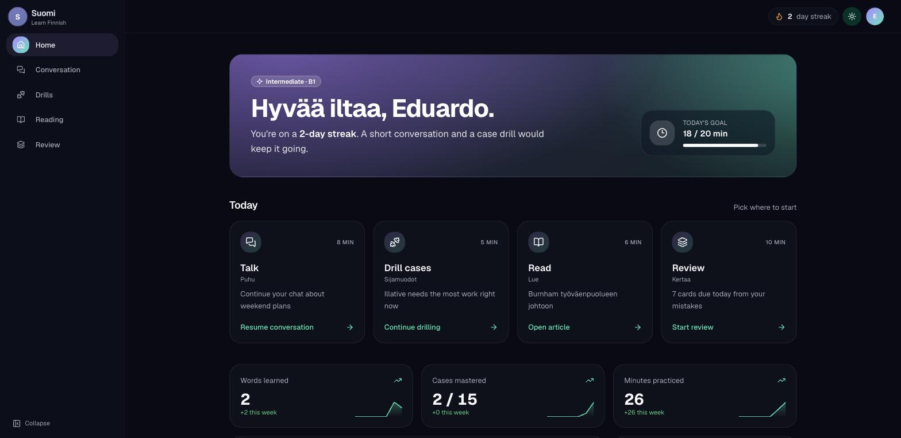
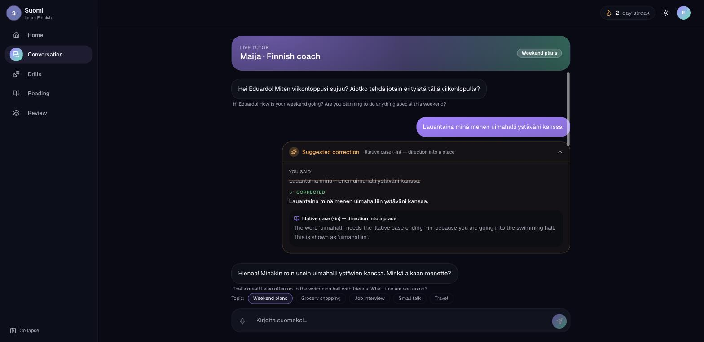
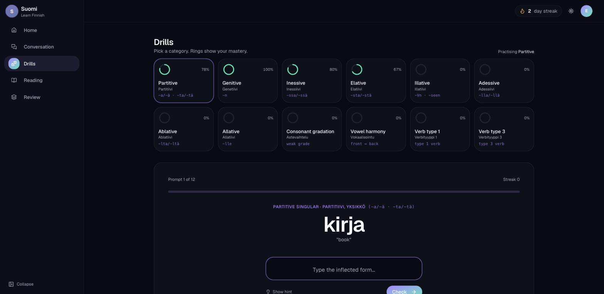
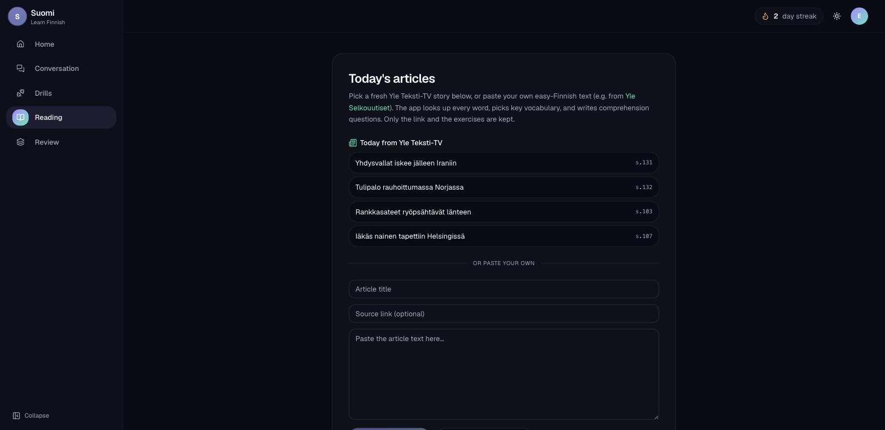

<h1 align="center">🇫🇮 Finnish Tutor <sub><i>· Suomi</i></sub></h1>

<p align="center">
  A calm, <b>local-first</b> web app to break the intermediate plateau in Finnish —
  AI conversation, morphology drills, easy-Finnish reading, and error-driven
  spaced repetition. Everything runs on your own machine, for free.
</p>

<p align="center">
  
  
  
  
  
</p>

<p align="center">
  
</p>

## ✨ Highlights

- 🗣️ **Talk to Maija** — free-form Finnish chat; every mistake becomes an inline correction with a plain-English rule.
- 🎯 **Deterministic drills** — cases, gradation, harmony, and verb types checked by **Voikko**, not the LLM, so answers are never hallucinated.
- 📰 **Read today's news** — pull a live story from **Yle Teksti-TV** or paste your own text; every word is tap-to-translate.
- 🔁 **Spaced repetition that's actually yours** — review cards are generated from *your own* mistakes, scheduled with FSRS.
- 🔒 **Local-first & private** — a local LLM (Ollama) + Voikko; no cloud API, no keys required, zero cost.

## The five screens

| Screen | What it does |
|---|---|
| **Conversation** | Chat in Finnish with "Maija" (local LLM). Every grammar mistake gets an inline correction card with a plain-English rule — and becomes a review card. |
| **Drills** | Cases, consonant gradation, vowel harmony, verb types. Answers are checked by **Voikko** (rule-based analyzer) — deterministic, never hallucinated. Mistakes become review cards. |
| **Reading** | Pick a live news story from **Yle Teksti-TV** (with an API key) or paste your own easy-Finnish article (e.g. Yle Selkouutiset). Every word is tap-to-translate (Voikko lemma + bundled Wiktionary dictionary), with LLM-generated vocabulary and comprehension questions, cached forever. |
| **Review** | FSRS spaced repetition over cards generated from *your own mistakes*. |
| **Home** | Streak, daily goal, mastery stats — all computed from real usage. |

<table>
  <tr>
    <td width="50%"><br><sub><b>Conversation</b> — inline corrections with a plain-English rule</sub></td>
    <td width="50%"><br><sub><b>Drills</b> — Voikko-checked, with mastery rings per case</sub></td>
  </tr>
  <tr>
    <td width="50%"><br><sub><b>Reading</b> — today's Yle Teksti-TV stories, or paste your own</sub></td>
    <td width="50%" valign="middle"><sub>Light and dark themes throughout. All progress — streaks, mastery, review scheduling — is computed from real usage in a local SQLite database.</sub></td>
  </tr>
</table>

## Architecture

- **Frontend:** React + Vite + Tailwind + shadcn/ui (`frontend/`)
- **Backend:** Python + FastAPI + SQLite (`backend/`)
- **LLM:** local Qwen via [Ollama](https://ollama.com) — no cloud API, zero cost
- **Morphology truth:** [Voikko](https://voikko.puimula.org/) — the analyzer decides correctness; the LLM only phrases explanations
- **SRS:** [py-fsrs](https://github.com/open-spaced-repetition/py-fsrs)
- **Dictionary:** built locally from the [kaikki.org](https://kaikki.org/dictionary/Finnish/) Wiktionary extract (CC BY-SA, see `NOTICE`; never committed)

LLM output is precomputed once and cached in SQLite (article vocab, questions);
only the conversation is live. Article text stays in your local database —
the repo ships code, not content.

## Setup (macOS / Linux)

Prerequisites: Node 20+, Python 3.12+, [uv](https://docs.astral.sh/uv/),
[Ollama](https://ollama.com), Voikko:

```bash
brew install libvoikko          # macOS (includes the Finnish dictionary)
# apt install libvoikko1 voikko-fi   # Debian/Ubuntu
ollama pull qwen3:32b           # or qwen3:8b on smaller machines
```

Then:

```bash
# Backend
cd backend
uv sync
cp .env.example .env                          # defaults are fine locally
uv run python scripts/build_dictionary.py     # one-time: ~4.6 GB download → 26 MB database
uv run python scripts/seed_drills.py          # seed the Voikko-verified drill bank
uv run uvicorn app.main:app --reload --port 8000

# Frontend (second terminal)
cd frontend
npm install
npm run dev                                   # http://localhost:5173 (proxies /api → :8000)
```

For production-style serving, `npm run build` in `frontend/` and FastAPI will
serve the built app itself at http://localhost:8000.

Check `GET /api/health` — it reports whether Voikko, Ollama, and the
dictionary are ready.

### Docker

```bash
docker compose up --build
# then, once: docker compose exec ollama ollama pull qwen3:32b
```

Note for Apple Silicon: Docker containers can't use the GPU, so Ollama inside
Docker is slow. Prefer running Ollama on the host and pointing the app at it
(`OLLAMA_HOST=http://host.docker.internal:11434` for the `app` service).

## Configuration (`backend/.env`)

| Variable | Default | Notes |
|---|---|---|
| `OLLAMA_MODEL` | `qwen3:32b` | `qwen3:8b` is much faster on modest hardware |
| `OLLAMA_HOST` | `http://localhost:11434` | |
| `YLE_APP_ID` / `YLE_APP_KEY` | empty | Optional — register your own at [developer.yle.fi](https://developer.yle.fi/). With a key, Reading lists today's headlines from Yle Teksti-TV (the only endpoint Yle's public API still serves). Without one, paste article text manually. |
| `USER_NAME` / `LEVEL` / `DAILY_GOAL_MINUTES` | `Eduardo` / `B1` / `20` | Level is a soft setting that tunes the tutor's register |
| `VOIKKO_DICT_PATH` | empty | Only if libvoikko can't find a system dictionary |

## Licensing

- **Code:** MIT (`LICENSE`)
- **Dictionary data** (built locally, not committed): CC BY-SA, from Wiktionary via kaikki.org — see `NOTICE`
- **Voikko** and **Qwen** weights are external dependencies with their own licenses
- **YLE content** is never stored in the repo; users bring their own API key, and the app keeps only links plus derived exercises
